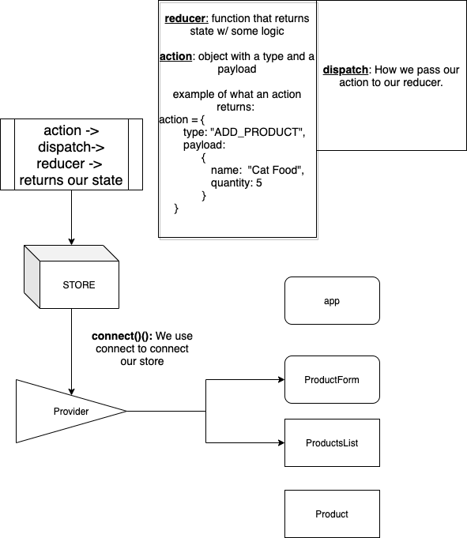

# Async Redux
Making an asynchronous request with redux. We will connect a backend with our current project and learn how we can use fetch to pass data to our backend.

---
## Vocab List: 
---
- What is CreateStore: 
    - what arguments does it take?
- What is the Provider: 
    - What should we give the provider to make it happen? 
- Reducer:
    - What arguments does it take? 
- Dispatch:
    - What arguments does it take?
- Action:
    - (END OF LECTURE): How does thunk change our action?
---
- Out of the four vocab words above, which actually makes a state change and a triggers a re-render? 
    - A. reducer
    - B. action
    - C. dispatch
    - D. provider
---
## Deliverables
---
1. Further Review:
    1. Create an Feed Cat Button
    1. Add some logic to our reducer that will update our state in the case we decide to feed our bodega cat
1. Create our rails backend
    1. Whitelist our server
    1. Seed Some data
1. Try to fetch in redux
    1. see what happens when we try to fetch using our dispatch
1. Apply middleware
    1. Take a look at thunk, and see how it affects our action
    1. make a get request to our backend using fetch
        1. get all products
    1. make a post request to our backend using fetch
        1. add a product
    1. if theres time make a patch request to our backend.
        1. feed our bodega cat
1. [Bonus] Create a loading screen
1. `IF BY SOME MIRACLE WE FINISH ON TIME TODAY`
    1. take 15 minutes to finish our pokemon react project. 
    1. make a way to filter pokemons
    1. make a way to remove our pokemons.
    1. give our pokemon privacy. 

# Intro to redux

Here is the node tree that we referenced in the video.
